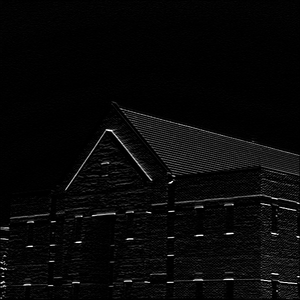
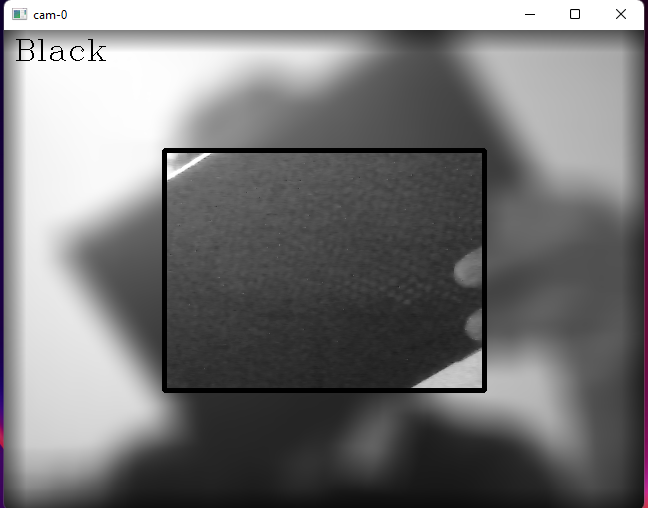

## Blur Background
- simply blur background of a flower manually using convolution technique.
>

## Convolution
- edge finding by convolution technique.
> 

## Edge Convolution
- horizontal and vertical edge detector by convolution technique.

> 

## Convolution Filters
- try some Convolution with different kernel size.
> 
> 
> 
> 

## 3 Shades Of Gray
- Diagnosis black-white-gray color on gray frame.
  > 
